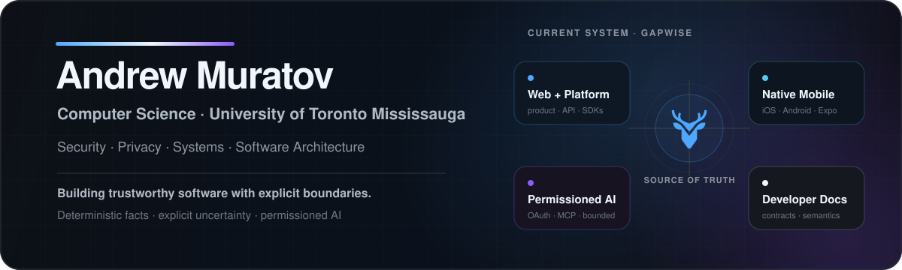

 

## About

I'm a Computer Science student at the **University of Toronto Mississauga** interested in information security, privacy, systems, and software architecture.

I care about software where the trust boundary is visible: **facts stay sourced, deterministic calculations stay deterministic, uncertainty survives the full stack, and AI operates through explicit permissions instead of quietly becoming the source of truth.**

Most of my current engineering work lives in **Gapwise**, a privacy-first student context and campus-intelligence system for UTM.

---

## Building now

<table>
<tr>
<td width="50%" valign="top">

### [Gapwise](https://github.com/andrewmuratov/gapwise)
**Web product + canonical platform**

Turns a local ACORN `.ics` export into timetable context, route-aware gap planning, leave-by timing, campus navigation, Day Replay, and deterministic campus intelligence.

`React 19` · `TypeScript` · `TanStack` · `MapLibre` · `Supabase` · `Bun`

**[Live app](https://gapwise.ca)** · **[API](https://api.gapwise.ca/v1)** · **[Source](https://github.com/andrewmuratov/gapwise)**

</td>
<td width="50%" valign="top">

### [Gapwise Mobile](https://github.com/andrewmuratov/gapwise-mobile)
**Native iOS + Android client**

A first-party Expo/React Native client that consumes canonical Gapwise product and platform semantics rather than recreating timetable, routing, or gap-planning truth.

`Expo` · `React Native` · `TypeScript` · `Expo Router`

**[Source](https://github.com/andrewmuratov/gapwise-mobile)** · **[Platform](https://api.gapwise.ca/v1)**

</td>
</tr>
<tr>
<td width="50%" valign="top">

### [Gapwise AI](https://github.com/andrewmuratov/gapwise-ai)
**Permissioned OAuth + MCP layer**

A provider-neutral integration service for explicitly delegated student context and bounded AI-facing actions, while Gapwise remains authoritative for schedules, routing, and gap calculations.

`Next.js` · `TypeScript` · `MCP` · `Supabase` · `Node.js`

**[Service](https://ai.gapwise.ca/api/health)** · **[MCP](https://ai.gapwise.ca/api/mcp)** · **[Source](https://github.com/andrewmuratov/gapwise-ai)**

</td>
<td width="50%" valign="top">

### [Gapwise Docs](https://github.com/andrewmuratov/gapwise-docs)
**Public developer documentation**

The documentation surface for the Gapwise API, OpenAPI 3.1 contract, SDKs, platform semantics, provenance/uncertainty model, and AI/MCP integration.

`OpenAPI 3.1` · `TypeScript` · `Python` · `Developer UX`

**[Docs](https://docs.gapwise.ca)** · **[OpenAPI](https://api.gapwise.ca/openapi.json)** · **[Source](https://github.com/andrewmuratov/gapwise-docs)**

</td>
</tr>
</table>

**One product identity. Four repositories. One source-of-truth hierarchy.**

---

## How I build

- **Privacy before convenience.** Minimize sensitive data, keep local processing local where possible, and make optional cloud access explicit.
- **Deterministic facts before inference.** Timetable arithmetic, routing, budgets, and leave-by calculations belong in tested domain logic.
- **Provenance and uncertainty are product data.** Unknown, approximate, inferred, stale, and verified states should remain distinguishable all the way to the interface.
- **Failure behavior is part of the feature.** Authentication, authorization, accessibility, offline state, stale data, degraded routing, and partial availability deserve deliberate semantics.

### Working stack

`TypeScript` · `React` · `Next.js` · `TanStack` · `React Native` · `Expo` · `Python` · `PostgreSQL / Supabase` · `MapLibre` · `Bun` · `Node.js` · `Linux` · `Vercel`

---

## Activity

Generated daily from GitHub activity.

---

## Current direction

I'm strengthening my foundations in **algorithms, systems, cryptography, discrete mathematics, and rigorous software engineering** while continuing to push Gapwise toward a coherent, inspectable platform across web, native mobile, public APIs, developer tooling, and permissioned AI.

> **Make useful things. Minimize sensitive data. Keep the source of truth clear. Test the failure modes.**

---

**[gapwise.ca](https://gapwise.ca)** · **[docs.gapwise.ca](https://docs.gapwise.ca)** · **[ai.gapwise.ca](https://ai.gapwise.ca/api/health)** · **[GitHub](https://github.com/andrewmuratov)** · **[ORCID](https://orcid.org/0009-0007-0561-2945)**

Security · privacy · systems · software.

